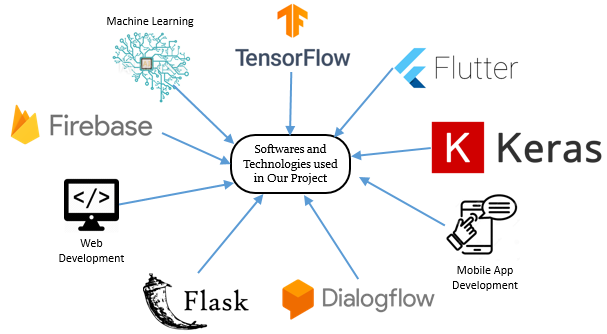
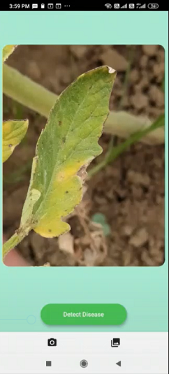
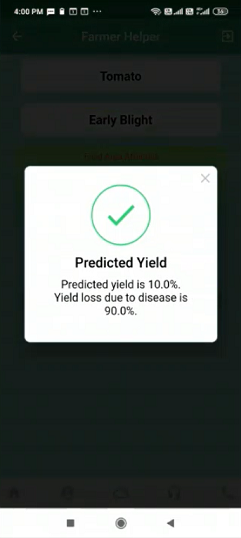

# Farmer Helper
App, Website and APIs to help farmers for estimation of their yield


```diff
-This project is a complete teamwork.
```
<b>TechnoBuilders</b>
<br>
<b>Winner SIH 2020 - NS270</b>
<br>
<b>Team Members</b>
<br>
<ul>
  <li>Saswat Panda</li>
  <li>Abhishek Sunil Tiwari</li>
  <li>Dipan Polley</li>
  <li>Biswajit Satapathy</li>
  <li>Preethi Chandirasekeran</li>
  <li>Bera Rahul Dilip</li>
</ul>
<br>
<h3>View our comprehensive Project Report at the link below</h3>
<a href="https://online.flippingbook.com/view/17195/">Click Here to View our Full Project Report as a Flipbook!</a>
<br>
<h2>Technology Stack</h2>

<ul>
  <li>Mobile App (Used by farmers)</li>
  <li>Web Interface (Used by government officials (DOA))</li>
  <li>Machine Learning model for Crop Yield Estimation</li>
  <li>Machine Learning model for Disease prediction</li>
  <li>Machine Learning model for Disease Based Yield Prediction</li>
</ul>


<h2>Softwares and Technologies Used</h2>



<h2>Mobile App Features</h2>
<ul>
<li>Healthy Crop Yield Estimation</li>
<li>Disease Prediction</li>
<li>Report Crop Failure</li>
<li>Voice Chatbot</li>
<li>Hindi to English and English to Hindi</li>
<li>Call for Assistance</li>
<li>Add/Update Crop details</li>
<li>View Crop details</li>
<li>OTP Verification</li>
</ul>


<h2><a href="https://abhishek-st.github.io/">Website</a> Features</h2>
<ul>
<li>View all crop failure reports from farmers</li>
<li>Resolve feature for crop failure reports that have been resolved</li>
<li>View all registered users</li>
<li>View history of crop yield estimation by farmers</li>
<li>View history of diseased crop yield estimation by farmers</li>
</ul>

<h4>Outputs for Disease Crop Yield Estimation





<a href="https://abhishek-st.github.io/">Website link</a><br>
<a href="https://github.com/Abhishek-st/Abhishek-st.github.io/">Website github link</a>
<br>
<br>
<a href="https://www.figma.com/file/mhtGuzwvJvB26OuOdnlS8b/SIH_PRO_2?node-id=0%3A1">Figma Design for App</a>
<br>
<a href="https://drive.google.com/drive/folders/19iBT22t-asQ0j0iyeWdhZZv0NbuT0YDi?usp=sharing">Drive Link For Video, PPT and APKS</a>
<br>

<b>Datasets</b>
<br>
<a href="https://drive.google.com/drive/folders/1RMjG4Vvg5aGCGlSS5KjTpWaOlPDuQrMw?usp=sharing">Dataset Link For Disease Detection</a>
<br>
<a href="https://drive.google.com/file/d/1RtQu52iitkpbUriVzpJcN_4wwuNycA80/view?usp=sharing">Dataset Link For Diseased Crop Yield Prediction</a>
<br>
<a href="https://aps.dac.gov.in/APY/Public_Report1.aspx">Dataset Link For Healthy Crop Yield Prediction</a>


